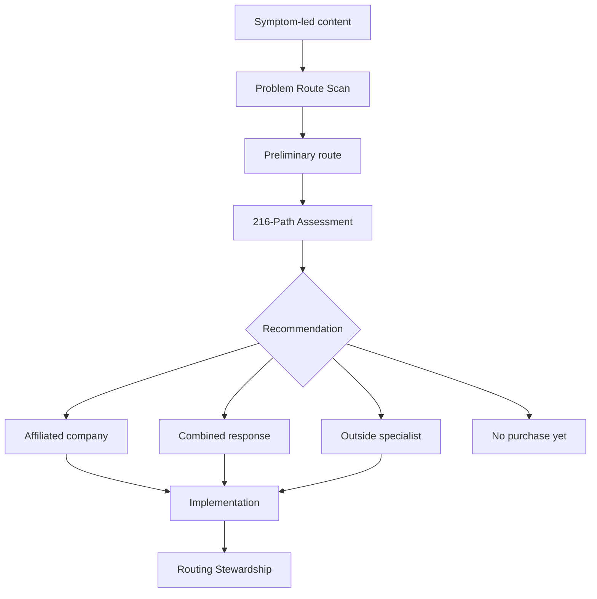

# Variety Portal — LAKA and Funnel Strategy

## Position

**Category:** Business Problem Routing

**Core promise:** Diagnose what is actually wrong, determine what should happen first, and route the work to the right solution.

**Tagline:** One Problem. 216 Possible Paths. One Recommended Next Move.

**Primary mechanism:** The Variety Routing Protocol™ powered by the existing 6×6×6 morphological engine.

## Portfolio role

Variety Portal is the neutral front door to Ryan Perez's business ecosystem. It does not compete with the specialized companies. It qualifies, diagnoses, sequences and routes work to them.

| Diagnosed constraint | Likely route |
|---|---|
| Brand positioning or identity | Brand Savant |
| Growth execution across channels | Bow Tie Kreative GrowthPoints |
| Calgary website and local demand | Web Dev Calgary |
| Website accessibility | All Inclusive Websites |
| Smart-home planning | HouseSmart |
| Search and customer-intent gaps | Goose Caboose |
| Marketing-system weakness | Digital Stem Cell |
| Alternative strategy generation | LAKA |
| Execution or environmental forecasting | PEX/PCC |
| Specialized need outside the portfolio | Disclosed external specialist |

## LAKA grid

| Variable | Current concept | Minor change | Major change | New category |
|---|---|---|---|---|
| Object purchased | Morphological operations audit | Workflow alternatives | Decision analysis | Diagnosed and routed business problem |
| Condition | SOP has a failure point | Workflow is fragile | Company faces uncertainty | Buyer sees symptoms but does not know what to buy |
| Action | Decompose SOP | Generate pathways | Compare strategies | Diagnose, generate, eliminate, prescribe and route |
| Tools | 6×6×6 matrix | Fragility calculator | LAKA/PEX/PCC | Portfolio-wide routing protocol |
| Resources | Operations consultant | Audit team | Strategy experts | Owned companies plus disclosed outside specialists |
| Outcome | Workflow resilience | Reduced fragility | Better decision | Correct intervention, provider and sequence |
| Buyer | Operations leader | COO | Founder/executive | Any qualified leader facing an expensive ambiguous problem |
| Revenue | Enterprise audit | Consulting | Assessment | Assessment, implementation, referral and stewardship |
| Customer burden | Understand morphology | Upload SOPs | Interpret alternatives | Explain the symptom in ordinary language |
| Role | Technical engine | Operations consultancy | Decision platform | Independent problem-routing office |

## Variety Routing Protocol™

### 1. Symptom

Capture what the buyer sees, what changed, where it appears and why it matters.

### 2. Decomposition

Separate objects, conditions, actions, tools, resources, stakeholders, dependencies and desired outcomes.

### 3. Variety

Run the 6 interrogatives × 6 relational modifiers × 6 quantitative scales to produce alternative explanations and pathways.

### 4. Elimination

Filter paths using evidence, strategic fit, urgency, reversibility, cost, capacity, risk and time to useful evidence.

### 5. Prescription

Identify the smallest sufficient intervention and what must happen first.

### 6. Routing

Recommend an affiliated company, combination of providers, external specialist, internal action or deliberate no-purchase path.

### 7. Review

Check whether the intervention changed the constraint or merely moved it.

## Offer ladder

| Stage | Offer | Suggested price | Purpose |
|---|---|---:|---|
| Entry | Problem Route Scan | Free or $47 | Classify symptom, urgency and assessment route |
| Core | 216-Path Business Assessment | $497–$1,500 | Diagnose, compare and recommend |
| Premium | Executive Decision Brief | $2,500–$7,500 | Multi-stakeholder, evidence-backed high-stakes decision |
| Implementation | Routed solution | Varies | Execute through affiliated or outside specialist |
| Recurring | Routing Stewardship | $500–$2,500/month | Reassess constraints and coordinate providers |

## Funnel

## Lead acquisition themes

- You do not have a traffic problem
- When a website problem is really a positioning problem
- Why every vendor diagnoses the problem they sell
- The cost of solving the right problem in the wrong order
- When automation makes a broken process faster
- Strategy versus execution: which are you missing?
- Three consultants, three answers: how to choose
- The Cost of Misdiagnosis Calculator

## Qualification

Prioritize problems with meaningful cost, a decision-maker, available evidence, budget, willingness to examine assumptions and capacity to implement.

Do not route immediately to a sales company when the assessment indicates that the buyer needs more evidence, internal alignment or no purchase.

## Trust architecture

Variety Portal must disclose affiliated-company and referral relationships.

Recommended disclosure:

> Variety Portal evaluates multiple paths. When we recommend a company affiliated with Variety Portal, we disclose that relationship. When an outside specialist is a better fit, we can recommend or help source one. Referral or commercial relationships are disclosed before engagement.

## Metrics

- Scan completion rate
- Scan-to-paid-assessment rate
- Diagnostic-route distribution
- Assessment-to-implementation rate
- Affiliated versus external routing mix
- Recommendation acceptance
- Time to useful evidence
- Percentage of cases where the constraint moved
- Client value recovered by stopping unnecessary work

